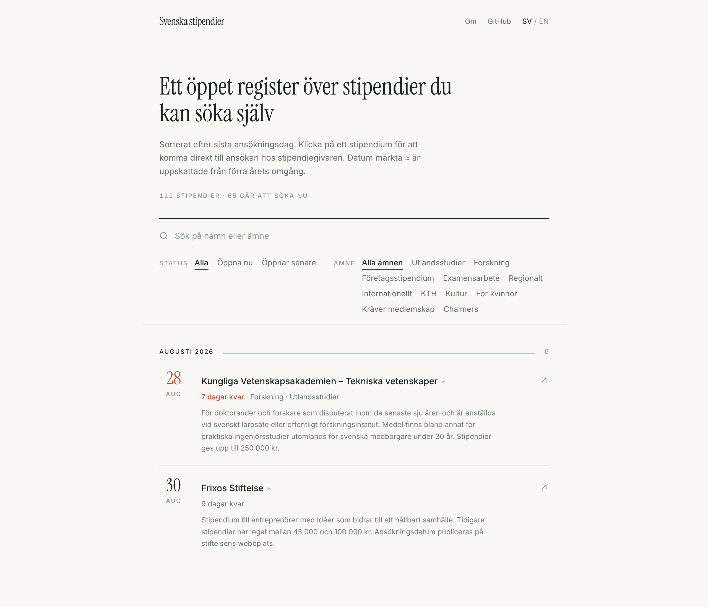
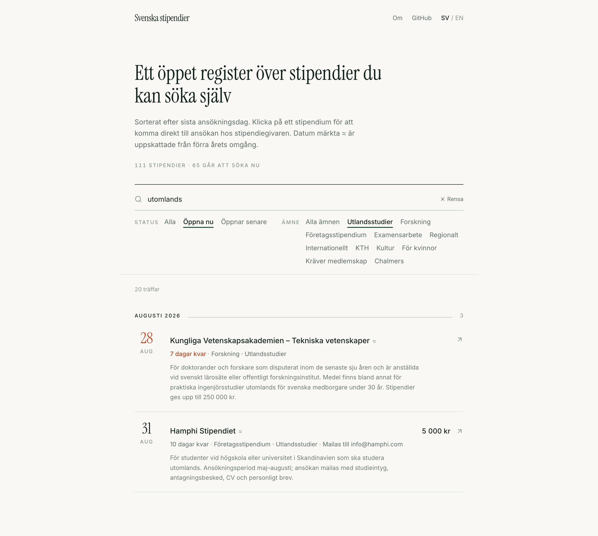

<p align="center">
  <a href="https://svenska-stipendier.vercel.app">
    
  </a>
</p>

<h1 align="center">Svenska stipendier</h1>

<p align="center">
  An open database of scholarships that students in Sweden can apply for,<br>
  and the site that browses it.
</p>

<p align="center">
  <a href="https://svenska-stipendier.vercel.app"><b>Open the site</b></a> ·
  <a href="data/scholarships">Browse the data</a> ·
  <a href="CONTRIBUTING.md">Contribute</a> ·
  <a href="../../issues/new?template=new-scholarship.yml">Add a scholarship</a> ·
  <a href="../../issues/new?template=fix-scholarship.yml">Report a problem</a>
</p>

<p align="center">
  <a href="https://svenska-stipendier.vercel.app"></a>
  <a href="https://github.com/filiporestav/svenska-stipendier/actions/workflows/ci.yml"></a>
  <a href="LICENSE"></a>
  <a href="https://creativecommons.org/licenses/by/4.0/"></a>
  <a href="https://www.linkedin.com/in/filiporestav"></a>
</p>

---

## What it is

Swedish scholarship money sits with hundreds of small foundations. Each one has its own page, its own dates and its own way of taking applications, and there is no shared listing anywhere, so students either pay for a subscription site or never hear about the money at all. A good part of it goes unclaimed every year.

**Svenska stipendier is that missing listing, kept in the open.** Every scholarship is a single JSON file in [`data/scholarships/`](data/scholarships), and the site is a static page built from those files. There is no database, no login, and nothing to pay for. You find an entry, click through to the awarding body, and apply yourself. The project never submits anything on anyone's behalf and stores nothing about you.

- **Sorted by deadline**, so the next thing worth applying for is at the top.
- **Search and filter** by subject, region, university, or whether the window is open now.
- **Swedish and English**, at `/` and `/en`.
- **The data is reusable.** Clone it, query it, or build something better on top of it.

<p align="center">
  
</p>

**The data is the point.** If you know a scholarship that is missing, a deadline that moved, or one that no longer exists, open an issue or send a pull request. See [CONTRIBUTING.md](CONTRIBUTING.md). You do not need to know React, or run anything locally, to help.

## What's in a scholarship file

```json
{
  "id": "kraftska-sallskapet",
  "name": "Kraftska Sällskapet",
  "url": "https://www.kraftska.se/stipendie/",
  "opens": "2025-10-01",
  "deadline": "2026-02-15",
  "recurrence": "annual",
  "apply_via": "website",
  "tags": ["utlandsstudier"],
  "typical_amount_sek": 10000,
  "last_verified": "2026-07-27"
}
```

Every field is documented in [`data/schema.json`](data/schema.json), and `npm run validate` checks each file against it. The same check runs on every pull request.

### About the dates

Stored dates record the last round we confirmed. Most Swedish scholarships recur annually, so the site rolls a past date forward to the next expected occurrence and marks it with `≈`. That is an estimate from last year's cycle, not an announcement, so always check the awarding body's own page before you rely on it.

## Running it locally

```bash
npm install
npm run dev       # http://localhost:8080
npm run validate  # check the data files
npm run build     # production build into dist/
npm run lint
```

Node 20 or newer. No environment variables, no API keys, no accounts.

## Project layout

```
data/scholarships/        one JSON file per scholarship, the source of truth
data/schema.json          what a scholarship file may contain
scripts/                  the data validator
src/lib/scholarships.ts   loads the data at build time, works out deadlines
src/pages/Directory.tsx   the list, search and filters
```

Stack: Vite, React, TypeScript and Tailwind, deployed as a static build. Conventions are documented in [AGENTS.md](AGENTS.md).

## Licence

Code is [MIT](LICENSE). The scholarship data in `data/` is [CC BY 4.0](https://creativecommons.org/licenses/by/4.0/): use it, build on it, just credit the project.

The data is maintained by volunteers and comes with no guarantee of accuracy. Verify against the awarding body before applying.
